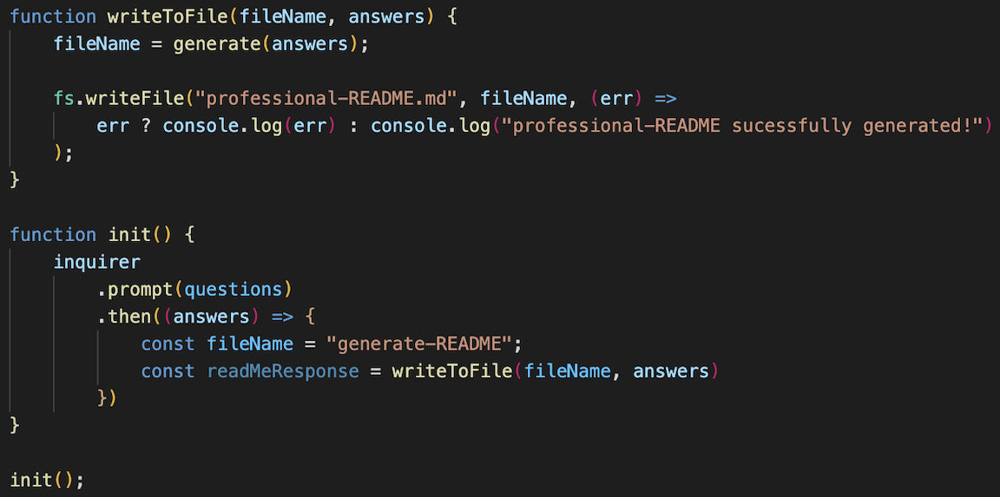

# Professional README Generator

## Description 

This program generates a readme.md file. Using node.js I ask questions via prompts in the terminal using the cmd line. Based off of the responses, a readme.md file is filled with the related information. See the following video here of how it works:

VIDEO HERE

I store the questions in an array. Each question is stored in an object. It is defined using a type, a message (the question), and a name. I first create a function that will use inquirer to prompt the questions. Then we will pass the responses or answers into a function to write the file. This function will pass the answers into a generate markdown javascript file. We take this information and use it to create the file. It will console log for use if it is suscessful. You can view this all below. 

## Installation

Install npm via "npm init". Following this, you will need to install inquirer entering, "npm i inquirer@8.2.4". A folder named node_modules will populate. This shows proper steps are happening. Open the directory in the intergrated terminal or terminal you are using. Run the index.js file using node, i.e. "node index". Follow the prompts to beging the file generation. Once completed a file named "generated-readme.md" will appear. 

## Usage 

Once you have successfully installed the correct componenets you will be prompted with the series of questions when entering "node index". You must be in the correct file for this to work. Once the prompts have been completed, the "professional-README.md" file will be created. 

## Credits

Node.js, inquirer, UCB Starter Code

## Contact Me

<a href="https://www.linkedin.com/in/tyler-dinslage-profile/" target="_blank">LinkedIN Profile</a>

<a href="https://github.com/tylerdins88?tab=repositories" target="_blank">Github Repo</a>

## License

Listed in repo file. 